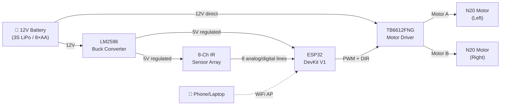
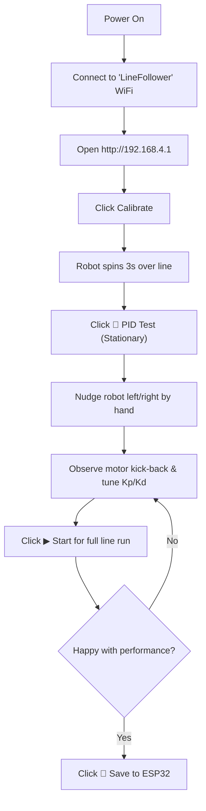

# Line Follower Robot — Complete Build Guide

**Components:** ESP32 DevKit V1 · 8-Channel IR Sensor Array · TB6612FNG Motor Driver · 2× N20 12V 600RPM DC Motors · LM2596 Buck Converter

---

## 1. System Architecture



---

## 2. Power Design

| Rail | Source | Voltage | Feeds |
|------|--------|---------|-------|
| **VBAT** | Battery | 11.1–12.6 V (3S LiPo) | TB6612FNG `VM` pin, LM2596 `IN+` |
| **5 V** | LM2596 output | 5.0 V | ESP32 `VIN` pin, IR sensor array `VCC` |
| **3.3 V** | ESP32 onboard regulator | 3.3 V | ESP32 GPIOs (internal) |

> [!IMPORTANT]
> **Set the LM2596 output to 5.0 V _before_ connecting the ESP32.** Turn the potentiometer screw and verify with a multimeter. Feeding >6 V into the ESP32 VIN will damage it.

> [!TIP]
> Add a **power switch** and a **reverse-polarity protection diode (1N5822)** on the battery positive line. A 470 µF electrolytic capacitor across the LM2596 output smooths motor-noise spikes.

---

## 3. Wiring

### 3.1 LM2596 Buck Converter

| LM2596 Pin | Connects To |
|------------|-------------|
| `IN+` | Battery + (12 V) |
| `IN-` | Battery − (GND) |
| `OUT+` | ESP32 `VIN`, IR array `VCC` |
| `OUT-` | Common GND rail |

### 3.2 Conflict-Free Pin Assignment

**Motor Driver (TB6612FNG → ESP32):**

| TB6612FNG Pin | ESP32 GPIO | Notes |
|---------------|-----------|-------|
| `VM` | Battery + (12 V) | Motor supply |
| `VCC` | 5 V rail | Logic supply |
| `GND` | Common GND | All GNDs tied together |
| `STBY` | GPIO 23 (or 5 V) | HIGH = enabled |
| `AIN1` | GPIO 16 | Motor A direction |
| `AIN2` | GPIO 17 | Motor A direction |
| `PWMA` | GPIO 18 | Motor A speed (PWM) |
| `BIN1` | GPIO 19 | Motor B direction |
| `BIN2` | GPIO 21 | Motor B direction |
| `PWMB` | GPIO 22 | Motor B speed (PWM) |
| `AO1/AO2` | Left Motor | |
| `BO1/BO2` | Right Motor | |

**IR Sensor Array (8 sensors → ESP32 ADC1):**

| Sensor | ESP32 GPIO |
|--------|-----------|
| S1 (leftmost) | GPIO 36 (`VP`) |
| S2 | GPIO 39 (`VN`) |
| S3 | GPIO 34 |
| S4 | GPIO 35 |
| S5 | GPIO 32 |
| S6 | GPIO 33 |
| S7 | GPIO 25 |
| S8 (rightmost) | GPIO 26 |

> [!NOTE]
> If a motor spins the wrong way, swap its `xO1`/`xO2` wires **or** swap the `xIN1`/`xIN2` GPIOs in software.

---

## 4. Web Dashboard

The firmware hosts a **WiFi Access Point** and serves a real-time web dashboard — no internet or router needed.

### 4.1 Dashboard Features

| Feature | Description |
|---------|-------------|
| **🎮 Robot Control** | Start, Stop, Calibrate, and **PID Test** mode with live state badge |
| **🧪 Stationary PID Test** | Robot stays stationary (`baseSpeed = 0`); if nudged off the line, it actively pivots back to center to test responsiveness |
| **📊 Live Stats** | Position, Error, Correction, Left/Right motor speed, Loop Hz |
| **🔍 Sensor Array** | 8 animated bar charts + a position dot indicator |
| **⚙️ PID Tuning** | Real-time sliders + numeric inputs for Kp, Ki, Kd, Base Speed |
| **💾 Save to Flash** | Persist PID values and calibration data across reboots |
| **📝 Event Log** | Timestamped event stream |
| **🔄 Auto-Reconnect** | WebSocket reconnects automatically if connection drops |

### 4.2 How to Connect

1. **Power on** the robot
2. On your phone/laptop, connect to WiFi network:
   - **SSID:** `LineFollower`
   - **Password:** `12345678`
3. Open a browser and go to **`http://192.168.4.1`**
4. The dashboard loads instantly — no internet required

### 4.3 Required Arduino Libraries

Install these via **Arduino Library Manager** (`Sketch → Include Library → Manage Libraries`):

| Library | Author | Purpose |
|---------|--------|---------|
| **WebSockets** | Markus Sattler | WebSocket server for real-time data |
| **ArduinoJson** | Benoît Blanchon | JSON serialization/deserialization |

> [!NOTE]
> `WiFi.h`, `WebServer.h`, and `Preferences.h` are **built-in** to the ESP32 Arduino core — no extra install needed.

### 4.4 Usage Workflow



---

## 5. Full Source Code

The complete firmware is located in: [line_follower_web.ino](file:///home/tusar/code/line_follower_web/line_follower_web.ino)

### Architecture overview:

```
┌──────────────────────────────────────────┐
│              ESP32 Firmware              │
├──────────────┬───────────────────────────┤
│  PID Engine  │    WiFi AP + Web Server   │
│  - Sensor    │    - HTTP (port 80)       │
│    reading   │    - WebSocket (port 81)  │
│  - Position  │    - Dashboard HTML/JS    │
│    calc      │      (PROGMEM)            │
│  - PID algo  │    - JSON telemetry       │
│  - Motor     │      @ 10 Hz             │
│    control   │    - Command handler      │
├──────────────┴───────────────────────────┤
│           Preferences (NVS Flash)        │
│   Kp, Ki, Kd, BaseSpeed, Calibration    │
└──────────────────────────────────────────┘
```

---

## 6. How the PID Works

### 6.1 Sensor Position Calculation

The 8 sensors are assigned weights from **−3500** (leftmost) to **+3500** (rightmost). A **weighted average** gives the line position:

$$
\text{position} = \frac{\sum_{i=0}^{7} (\text{normalized}_i \times \text{weight}_i)}{\sum_{i=0}^{7} \text{normalized}_i}
$$

- **Position = 0** → line is centered
- **Position = −3500** → line is far left → turn left
- **Position = +3500** → line is far right → turn right

### 6.2 PID Controller

$$
\text{correction} = K_p \cdot e(t) + K_i \cdot \int e(t)\,dt + K_d \cdot \frac{de(t)}{dt}
$$

| Term | Effect | Too High → | Too Low → |
|------|--------|-----------|----------|
| **Kp** | Reacts to current error | Oscillation | Sluggish |
| **Ki** | Eliminates steady-state drift | Windup / overshoot | Drift on curves |
| **Kd** | Dampens oscillations | Jitter / noise | Overshoot |

---

## 7. PID Tuning Guide

### Step-by-step (via the dashboard):

1. **Bench Tuning with "PID Test" Mode (Stationary):**
   - Place robot centered on the line and click **🧪 PID Test**.
   - With `baseSpeed = 0`, the robot will sit completely still.
   - Gently nudge or twist the robot off the line by hand.
   - If **Kp is too low**: Motors will push back weakly or not at all.
   - Increase **Kp** until the wheels push back firmly against your hand to recenter.
   - If the robot twitches/rings upon release: Increase **Kd** to dampen the snap-back.
2. **Track Run:**
   - Once the hand-push response feels snappy and stable, click **▶ Start**.
   - Watch the robot track the line at `baseSpeed = 150`.
   - If it drifts on gentle curves, increase **Ki** slightly.
3. Click **"Save to ESP32"** once satisfied.

### Starting values for N20 600RPM + 8 sensors:

| Parameter | Start | Range |
|-----------|-------|-------|
| `Kp` | 0.05 | 0.01 – 0.2 |
| `Ki` | 0.0001 | 0 – 0.001 |
| `Kd` | 0.8 | 0.1 – 5.0 |
| `Base Speed` | 150 | 80 – 220 |

---

## 8. Physical Assembly

```
        ┌─────────────────────────┐
        │       ESP32 DevKit      │
        │   (mounted on top deck) │
        ├─────────────────────────┤
        │    LM2596  │  TB6612FNG │  ← middle/bottom deck
        ├──────┬─────┴──────┬─────┤
        │ N20  │            │ N20 │  ← motors at rear
        │(Left)│            │(Rgt)│
        └──────┘            └─────┘
   ┌──────────────────────────────────┐
   │   8-Ch IR Sensor Array (front)   │  ← 5–10mm above ground
   └──────────────────────────────────┘
           ◯ (ball caster at front)
```

| Aspect | Recommendation |
|--------|---------------|
| **Sensor height** | 5–10 mm above ground |
| **Sensor placement** | Front, ahead of caster |
| **Caster** | Ball caster or omni wheel |
| **Center of gravity** | Battery centered and low |
| **Noise filtering** | 470 µF cap at LM2596 output; 100 nF ceramic at each motor |

---

## 9. Troubleshooting

| Problem | Likely Cause | Fix |
|---------|-------------|-----|
| Can't connect to WiFi | AP not started | Check serial monitor for "AP IP: 192.168.4.1" |
| Dashboard shows "Disconnected" | WebSocket port blocked | Ensure you're on the robot's WiFi, try `http://192.168.4.1` |
| Robot doesn't move | STBY not HIGH | Check GPIO 23 / hardwire STBY to 5V |
| Violent oscillation | Kp too high | Reduce Kp via dashboard, increase Kd |
| Sensors all read same value | Too far from ground | Lower sensor bar to 5–10 mm |
| ESP32 resets randomly | Motor noise | Add capacitors (see assembly tips) |
| Calibration bad | Sweep too narrow | Increase calibration time in code (3000 → 5000 ms) |

---

## 10. Enhancements

- **OTA firmware updates** — upload new code over WiFi without USB
- **Intersection handling** — detect all-black (intersection) and execute stored turns
- **Speed profiling** — auto slow before sharp curves
- **Encoders** — closed-loop speed control on N20 shafts
- **OLED display** — show battery, state, PID on an SSD1306 onboard
